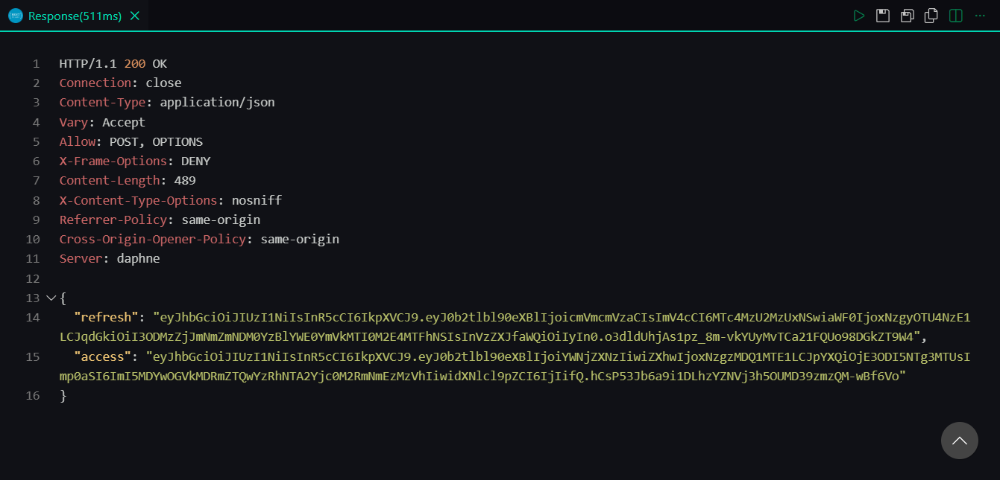
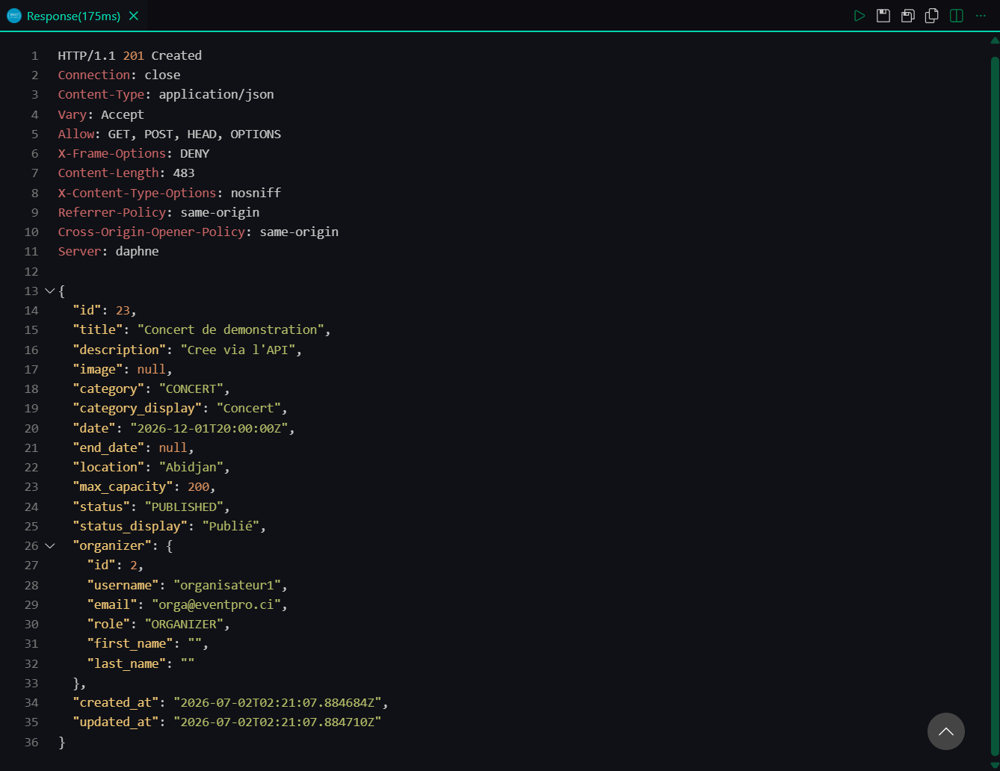
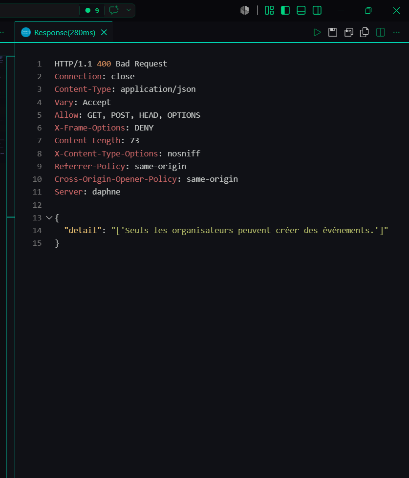
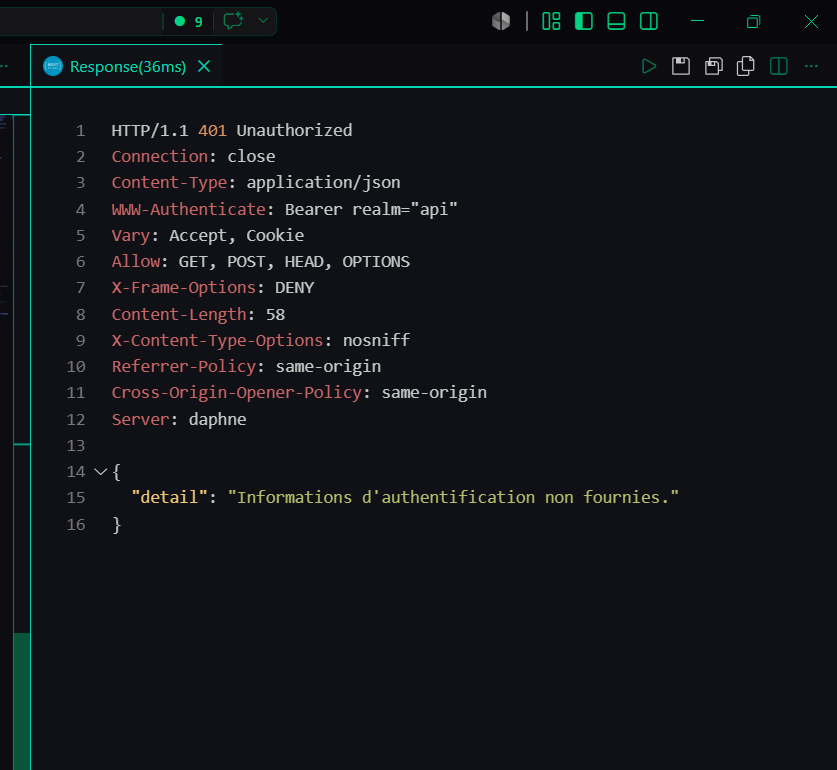
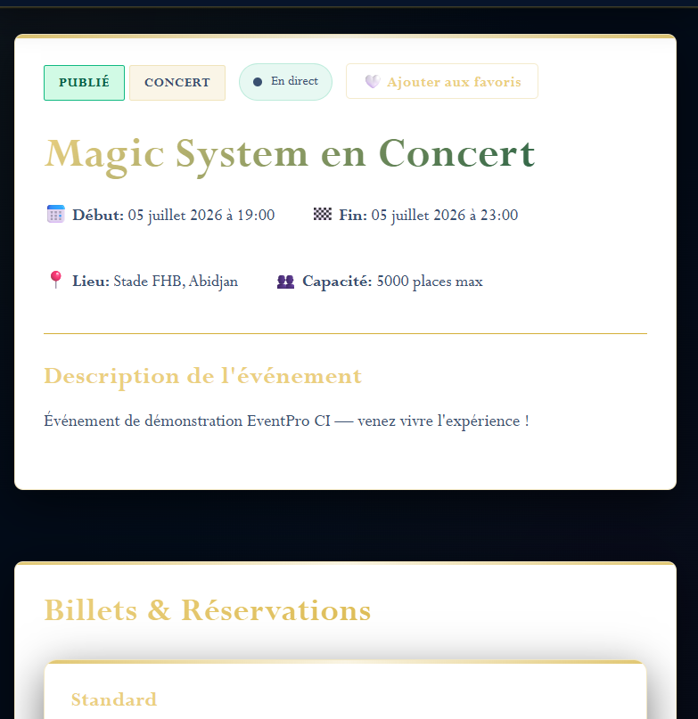
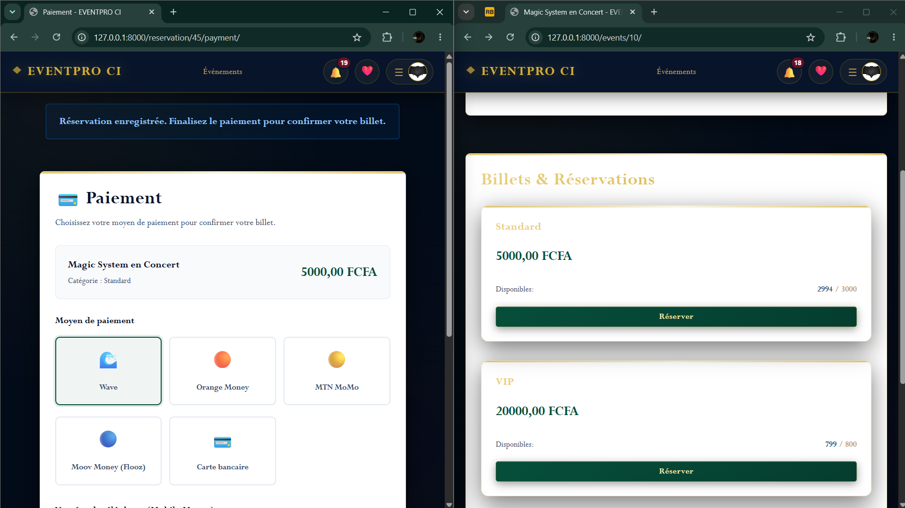
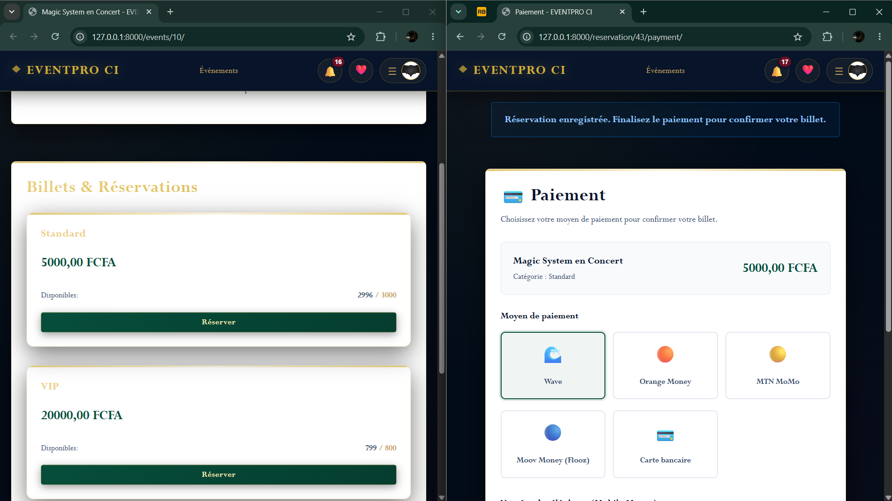

# EVENTPRO CI

**EVENTPRO CI** est une plateforme de billetterie événementielle pensée pour le contexte ivoirien. Elle permet à des organisateurs de publier leurs événements (concerts, marathons, festivals, événements religieux, tourisme…), de vendre des billets et de suivre leurs ventes **en direct**, pendant que les participants réservent et paient leurs places par Mobile Money.

Le projet est construit avec **Django REST Framework** pour l'API et **Django Channels** pour le temps réel (WebSocket via Redis).

---

## Ce que fait l'application

Concrètement, trois profils cohabitent sur la plateforme.

**Le participant** parcourt les événements publiés, les filtre par catégorie, date ou lieu, ajoute ceux qui l'intéressent à ses favoris, puis réserve un billet. Chaque réservation génère un **code unique (UUID)** et l'amène vers une page de paiement où il choisit son moyen : **Wave, Orange Money, MTN MoMo, Moov Money (Flooz) ou carte bancaire**. Une règle métier l'empêche de réserver deux événements qui se déroulent au même moment (chevauchement d'horaires), sauf s'il annule d'abord l'un des deux.

**L'organisateur** crée et gère ses événements — chaque événement appartient à un seul organisateur — avec un cycle de vie clair : *brouillon → publié → annulé / terminé*. Il définit ses types de billets (Standard, VIP, Étudiant…) avec leur prix et leur quota, puis suit son activité depuis un tableau de bord : nombre de billets vendus par événement, recettes générées, et la liste des participants avec leur statut de paiement.

**L'administrateur** supervise toute la plateforme depuis un back-office : statistiques globales (utilisateurs, événements, billets vendus), recettes encaissées, **commission de 10 %** prélevée sur les ventes (modèle inspiré de Tikerama) et montant net reversé aux organisateurs.

Enfin, tout le monde profite du **temps réel** : quand un organisateur change le statut d'un événement ou qu'un billet est vendu, les participants connectés à la page voient l'information se mettre à jour **sans recharger** — le badge de statut change et le nombre de places disponibles diminue tout seul.

---

## Stack technique

| Composant | Technologie |
| --- | --- |
| Framework web & API | Django 4.2 + Django REST Framework |
| Temps réel | Django Channels 4 + WebSocket (serveur Daphne) |
| Broker de messages | Redis (`channels-redis`) |
| Authentification | JWT (`djangorestframework-simplejwt`) |
| Base de données | SQLite (développement) |
| Traitement d'images | Pillow |

---

## Organisation du code

Le projet est découpé en quatre applications Django, chacune responsable d'un domaine précis :

```
eventpro/        Configuration du projet (settings, urls, asgi)
users/           Utilisateurs, rôles, authentification JWT, profil, back-office admin
events/          Événements, catégories, favoris
tickets/         Types de billets, réservations, paiements, tableau de bord
notifications/   WebSocket (consumers, routing) + notifications persistantes
```

À l'intérieur de chaque application, la logique suit toujours le même fil : les **modèles** décrivent les données, les **services** (`services.py`) portent la logique métier (réservation, paiement, changement de statut…), et les **vues** l'exposent — soit en pages HTML (MVT), soit en API REST (`api_views.py`). Cette séparation garde la logique métier au même endroit, réutilisable par le site web comme par l'API.

---

## Installation et lancement

### Avec Docker (le plus simple)

Si Docker Desktop est installé, une seule commande suffit pour tout démarrer — Django **et** Redis ensemble, avec le temps réel activé automatiquement :

```bash
docker compose up --build
```

L'application est alors disponible sur **http://127.0.0.1:8000/**, les migrations sont appliquées au démarrage, et aucune autre installation (ni Python, ni Redis) n'est nécessaire.

Pour créer un compte administrateur, puis arrêter les conteneurs :

```bash
docker compose exec web python manage.py createsuperuser
docker compose down
```

### Sans Docker

Il faut Python 3.10 ou plus. On crée un environnement virtuel, on installe les dépendances et on applique les migrations :

```bash
python -m venv venv
venv\Scripts\Activate.ps1        # Windows (PowerShell)
# source venv/bin/activate       # Linux / macOS

pip install -r requirements.txt
python manage.py migrate
python manage.py createsuperuser
python manage.py runserver
```

En mode `runserver`, le WebSocket fonctionne avec un Channel Layer **en mémoire** — parfait pour développer sans Redis.

Pour activer **Redis** (conforme à la version complète, et indispensable en production multi-processus), il suffit de lancer un serveur Redis et de renseigner la variable `REDIS_URL` avant de démarrer le serveur ASGI :

```bash
docker run -d -p 6379:6379 --name eventpro-redis redis

$env:REDIS_URL = "redis://127.0.0.1:6379"   # Windows (PowerShell)
# export REDIS_URL="redis://127.0.0.1:6379" # Linux / macOS
daphne eventpro.asgi:application
```

Si `REDIS_URL` n'est pas défini, l'application repasse automatiquement sur le mode mémoire : elle continue de fonctionner sans Redis.

---

## Comptes de démonstration

La base fournie contient déjà des comptes prêts à l'emploi pour tester chaque rôle :

| Rôle | Identifiant | Mot de passe |
| --- | --- | --- |
| Administrateur | `admin` | `Admin@2025` |
| Organisateur | `organisateur1` | `Orga@2025` |
| Organisateur | `organisateur2` | `Orga@2025` |
| Participant | `participant1` | `Part@2025` |

---

## Schéma de la base de données

Le cœur du modèle relie les utilisateurs, les événements, les billets et les paiements de la façon suivante :

```
┌─────────────────────┐         ┌──────────────────────┐
│      CustomUser     │         │        Event         │
├─────────────────────┤         ├──────────────────────┤
│ id (PK)             │◄───┐    │ id (PK)              │
│ username            │    │    │ title                │
│ email               │    │    │ description          │
│ password (hash)     │    │    │ image                │
│ role                │    └────│ organizer (FK User)  │
│ photo               │         │ category             │
│ first_name          │         │ status               │
│ last_name           │         │ date / end_date      │
└─────────────────────┘         │ location             │
        ▲                        │ max_capacity         │
        │ M2M (favorited_by)     │ favorited_by (M2M)   │
        └────────────────────────│ created_at/updated_at│
                                 └──────────┬───────────┘
                                            │ 1..N
                                            ▼
                                 ┌──────────────────────┐
                                 │      TicketType      │
                                 ├──────────────────────┤
                                 │ id (PK)              │
                                 │ event (FK)           │
                                 │ name                 │
                                 │ price                │
                                 │ quota                │
                                 │ sold_count           │
                                 └──────────┬───────────┘
                                            │ 1..N
                                            ▼
┌─────────────────────┐         ┌──────────────────────┐
│      Payment        │         │     Reservation      │
├─────────────────────┤         ├──────────────────────┤
│ id (PK)             │         │ id (PK)              │
│ reservation (O2O)   │────────►│ ticket_type (FK)     │
│ method              │         │ user (FK User)       │
│ phone_number        │         │ ticket_code (UUID)   │
│ amount              │         │ status               │
│ reference (UUID)    │         │ payment_status       │
│ is_successful       │         │ created_at/updated_at│
└─────────────────────┘         └──────────────────────┘

┌─────────────────────┐
│    Notification     │
├─────────────────────┤
│ id (PK)             │
│ recipient (FK User) │
│ message             │
│ url                 │
│ is_read             │
│ created_at          │
└─────────────────────┘
```

En résumé : un **événement** appartient à un seul **organisateur** et peut être mis en favori par plusieurs utilisateurs ; il possède plusieurs **types de billets** ; chaque **réservation** relie un participant à un type de billet et porte un code UUID unique ; et chaque réservation payée est associée à un **paiement** (relation un-à-un) qui enregistre le moyen utilisé et sa référence. Les **notifications** sont rattachées à leur destinataire.

---

## API REST

L'API est servie sous `http://127.0.0.1:8000`. L'authentification se fait par **JWT** : on récupère un token via `/api/token/`, puis on l'envoie dans l'en-tête `Authorization: Bearer <token>` pour toutes les routes protégées.

### Authentification

| Méthode | Endpoint | Description |
| --- | --- | --- |
| POST | `/api/register/` | Inscription (rôle limité à Organisateur ou Participant) |
| POST | `/api/token/` | Connexion — renvoie un `access` et un `refresh` |
| POST | `/api/token/refresh/` | Renouvelle le token d'accès |

### Événements

| Méthode | Endpoint | Description | Accès |
| --- | --- | --- | --- |
| GET | `/api/events/` | Liste des événements | Public |
| POST | `/api/events/` | Créer un événement | Organisateur |
| GET | `/api/events/<id>/` | Détail d'un événement | Public |
| PUT | `/api/events/<id>/` | Modifier | Organisateur / Admin |
| DELETE | `/api/events/<id>/` | Supprimer | Organisateur / Admin |

### Billetterie

| Méthode | Endpoint | Description | Accès |
| --- | --- | --- | --- |
| POST | `/api/tickets/types/` | Créer un type de billet | Organisateur |
| POST | `/api/tickets/book/` | Réserver un billet | Participant |
| POST | `/api/tickets/cancel/<id>/` | Annuler une réservation | Connecté |
| GET | `/api/tickets/dashboard/` | Tableau de bord organisateur | Organisateur |

Exemple concret : on se connecte pour obtenir un token, puis on crée un événement avec ce token.

```bash
# 1. Obtenir un token
curl -X POST http://127.0.0.1:8000/api/token/ \
  -H "Content-Type: application/json" \
  -d '{"username": "organisateur1", "password": "Orga@2025"}'

# 2. Créer un événement (en collant le token reçu)
curl -X POST http://127.0.0.1:8000/api/events/ \
  -H "Content-Type: application/json" \
  -H "Authorization: Bearer <ACCESS_TOKEN>" \
  -d '{"title": "Mon événement", "description": "...", "date": "2026-12-01T20:00:00Z", "location": "Abidjan", "max_capacity": 200}'
```

Une collection **Postman** (`docs/eventpro_ci.postman_collection.json`) et un fichier **REST Client** (`docs/api.http`) sont fournis pour tester tous ces endpoints rapidement.

---

## Temps réel (WebSocket)

Chaque événement dispose de sa propre « salle » WebSocket à l'adresse `ws://127.0.0.1:8000/ws/event/<id>/`. La page de détail s'y connecte toute seule au chargement. Dès qu'un organisateur change le statut de l'événement, ou qu'une réservation modifie le nombre de places, un message est diffusé à tous les navigateurs connectés à cette salle, qui mettent à jour l'affichage instantanément.

En coulisses, c'est **Redis** qui achemine ces messages entre les processus. On peut d'ailleurs les voir défiler en direct :

```bash
docker exec -it eventpro-redis redis-cli MONITOR
```

---

## Démonstration (captures)

### API — authentification et rôles

Connexion JWT réussie, avec le token renvoyé (`POST /api/token/` → 200) :



Un organisateur authentifié crée un événement (`POST /api/events/` → 201) :



À l'inverse, un participant qui tente de créer un événement est refusé (→ 400) — la vérification du rôle fonctionne :



Et une requête sans token est rejetée (→ 401) :



Enfin, le tableau de bord organisateur renvoie les ventes, recettes et participants. La réponse complète (assez longue) est disponible dans le fichier [postman-5-dashboard.txt](docs/postman-5-dashboard.txt).

### Temps réel

La page de l'événement se connecte au WebSocket : le badge passe à « En direct ».



Preuve du direct : dans la fenêtre de gauche, un billet est réservé ; dans la fenêtre de droite, le nombre de places disponibles diminue **tout seul**, sans rechargement.



### Paiement Mobile Money

La page de paiement propose les moyens locaux (Wave, Orange Money, MTN MoMo, Moov/Flooz) et la carte bancaire :



---

## Remarque

Le paiement Mobile Money est **simulé** : aucune transaction réelle n'est effectuée, l'objectif étant de démontrer le flux complet « réservation en attente → paiement → billet confirmé ». La base `db.sqlite3` et le dossier `media/` (affiches, photos de profil) ne sont pas versionnés.

---

*Projet de fin de module — Licence 2, Développement Web Avancé.*

**Réalisé par Touré Lamine.**